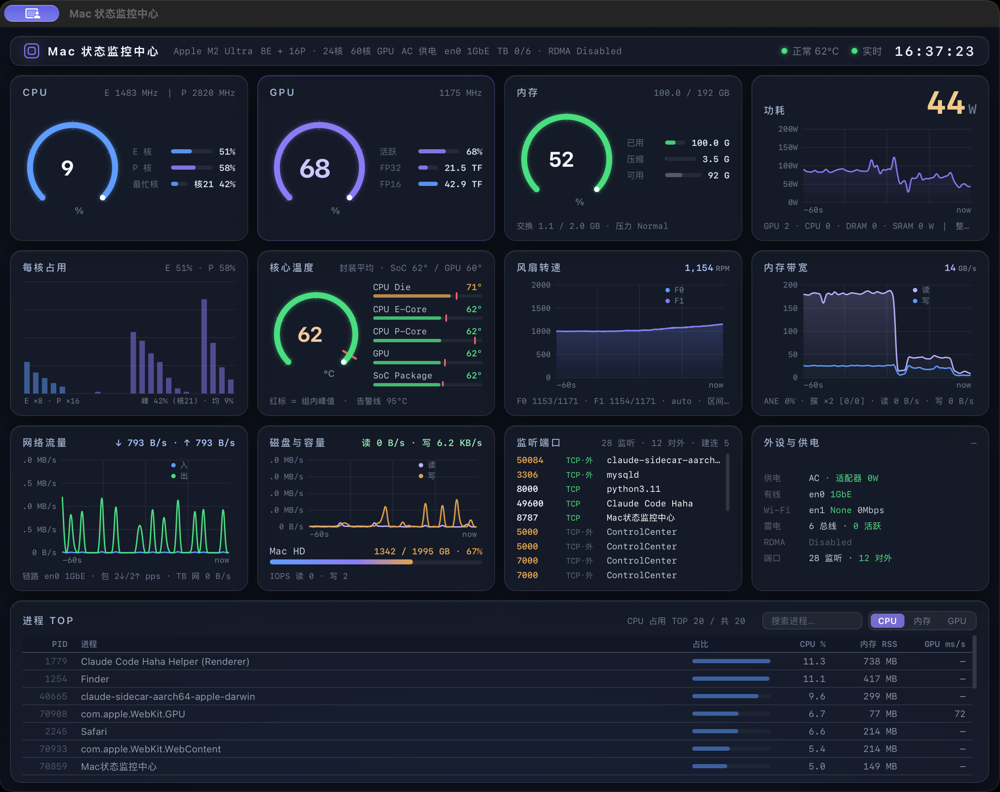

# mactop-web

把本机 [mactop](https://github.com/metaspartan/mactop) 封装成一个独立的 **Web 仪表盘**：
深色 HUD 毛玻璃界面、实时刷新，数据通信与 mactop 完全一致（原样转发 `mactop --headless --format json` 的采样数据，无任何加工）。



```
┌────────────┐  headless JSON   ┌──────────────┐  SSE (/api/stream)   ┌──────────┐
│  mactop    │ ───────────────► │  server.py   │ ────────────────────► │ 浏览器 UI │
│ (IOReport/ │   stdout 原样     │ stdlib HTTP  │  每个采样周期推送一条   │  Canvas  │
│  SMC 采样) │                   │ 零第三方依赖  │                       │  图表     │
└────────────┘                  └──────────────┘                       └──────────┘
```

- **数据一致**：浏览器收到的每条 SSE 消息就是 mactop headless 模式的原样 JSON（仅加 `server_ts` 传输戳）。
- **零第三方依赖**：后端只用 Python 标准库；前端手写 Canvas 图表 + SSE，无 CDN、无框架。
- **独立运行**：`run.sh` 一键启动，访问 `http://127.0.0.1:8787`。

## 界面内容（深色 HUD 毛玻璃，4×3 卡片网格）

- **顶部系统栏**：设备型号 / 核心与 GPU 规格 / 热状态 / 数据流状态 / 时钟
- **第 1 行**：CPU · GPU（最高优先级，细紫色环形进度 + FP32/FP16）· 内存 · 功耗（紫色填充折线）
- **第 2 行**：每核占用柱状图 · 核心温度（环随温度绿→橙→红动态渐变，95℃ 告警红线）· 风扇转速（旋转动画）· ANE 神经引擎
- **第 3 行**：网络流量 · 磁盘 IO · 存储容量 · 进程 TOP 表（可搜索排序，仅显示高负载进程）

配色：深黑底 `#0c101a`，蓝 `#5f9dff`、紫 `#8b7cf6`、薄荷绿 `#4ade80`、柔琥珀 `#e0a34e`、柔红 `#ef6a6a`；图表统一 60 秒时间轴，平滑曲线 + 低透明网格 + 同色填充。

## 独立应用（推荐）

**下载**：[GitHub Release](https://github.com/ccc94660531-maker/mactop-web/releases) 里的
`MacStatusCenter-v1.0.0.dmg`（约 17 MB，Apple Silicon）——**拖入 Applications 即完成安装**：
内嵌 Python 运行时 + mactop 二进制 + 全部前端资源 + 专属图标，目标 Mac 无需安装任何东西。

- 安装后双击启动，弹出**独立应用窗口**（内嵌系统 WKWebView，非浏览器标签页），全量监控指标实时刷新；
- 拖到副屏后按窗口绿色按钮全屏，即可常显；关闭窗口 = 退出应用；
- 首次启动右键 →「打开」（未做 Apple 公证，Gatekeeper 只提示一次）；
- 只做后台服务（无界面）：`open -a Mac状态监控中心 --args --no-browser`。

重新打包（本机需要 Python 3 + Homebrew）：

```bash
python3 -m venv /tmp/pbenv && /tmp/pbenv/bin/pip install pyinstaller pywebview

# 图标：static/app-icon.svg → 多尺寸 iconset → icns
qlmanage -t -s 1024 -o /tmp/ic static/app-icon.svg
mkdir -p /tmp/ic/AppIcon.iconset
for s in 16 32 64 128 256 512 1024; do
  sips -z $s $s /tmp/ic/app-icon.svg.png \
    --out "/tmp/ic/AppIcon.iconset/icon_${s}x${s}.png" >/dev/null
done
for s in 16 32 128 256; do
  cp "/tmp/ic/AppIcon.iconset/icon_$((s*2))x$((s*2)).png" \
     "/tmp/ic/AppIcon.iconset/icon_${s}x${s}@2x.png"
done
iconutil -c icns /tmp/ic/AppIcon.iconset -o /tmp/ic/AppIcon.icns

# 打包（onedir：单进程、启动快）
/tmp/pbenv/bin/pyinstaller -y --onedir --windowed --name "Mac状态监控中心" \
  --add-data "$PWD/static:static" \
  --add-data "$(brew --prefix)/bin/mactop:." \
  --icon /tmp/ic/AppIcon.icns \
  --distpath dist server.py
# 安装包（拖拽安装布局）
mkdir -p /tmp/dmgstage && cp -R "dist/Mac状态监控中心.app" /tmp/dmgstage/ && ln -s /Applications /tmp/dmgstage/Applications
hdiutil create -volname "Mac 状态监控中心" -srcfolder /tmp/dmgstage -ov -format UDZO dist/MacStatusCenter-vX.Y.Z.dmg
# 产物：dist/MacStatusCenter-vX.Y.Z.dmg → GitHub Release 附件
```

## 运行（源码方式）

```bash
./run.sh                 # 默认 127.0.0.1:8787，1s 刷新
./run.sh --port 9000   # 自定义端口
./run.sh --interval 500 # 更高频率（受 mactop 采样开销限制）
```

源码方式前置条件：macOS 且已安装 mactop（`brew install mactop`）；打包方式无此要求。

## 目录

```
server.py        # stdlib HTTP 服务器：托管前端 + SSE 推送 + 管理 mactop 子进程
run.sh           # 启动脚本
static/          # 前端（index.html / style.css / app.js / favicon.svg）
.home/           # 服务私有的 HOME（mactop 的配置/日志写这里，避免与手动运行互扰）
```

## API

- `GET /api/stream` — SSE：连接时先推一条 `event: snapshot`（当前历史缓冲），之后每个 mactop 采样周期推一条 `data:`（原样 JSON）。
- `GET /api/snapshot` — 一次性返回缓冲内的历史样本。
- `GET /api/status` — 服务器/子进程健康状态。

## 开机自启（可选）

```bash
cp launchd/com.user.mactop-web.plist ~/Library/LaunchAgents/
launchctl load ~/Library/LaunchAgents/com.user.mactop-web.plist
# 停止：launchctl unload ~/Library/LaunchAgents/com.user.mactop-web.plist
```
